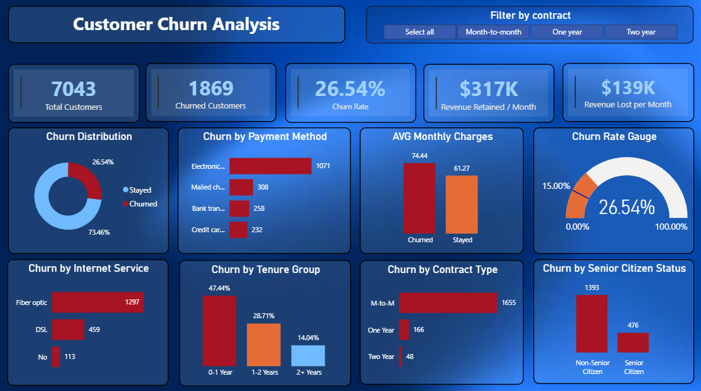
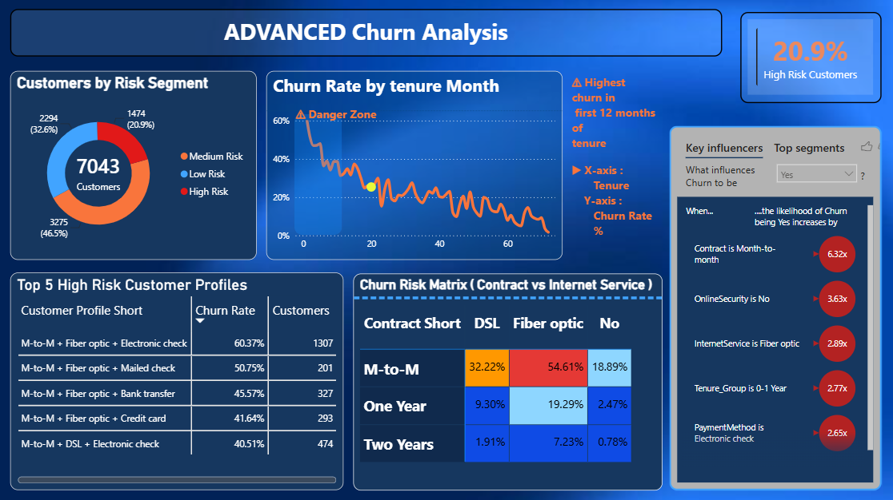

# 📊 Customer Churn Analysis

An end-to-end Customer Churn Analysis project using **Python (Pandas, NumPy, Matplotlib, Seaborn)** for data cleaning and exploratory data analysis, **SQL** for business analysis, and **Power BI** for interactive dashboard development.

---

## 📌 Project Objective

The objective of this project is to analyze customer churn behavior using the IBM Telco Customer Churn dataset and identify the key factors influencing customer attrition. The insights can help businesses improve customer retention and reduce revenue loss.

---

## 🛠️ Tools & Technologies

- Python
  - Pandas
  - NumPy
  - Matplotlib
  - Seaborn
- Jupyter Notebook
- SQL (MySQL)
- Power BI


---

## 📂 Project Workflow

### 1. Data Cleaning (Python)

- Loaded the IBM Telco Customer Churn dataset
- Converted `TotalCharges` from object to float
- Handled missing values using median imputation
- Verified data quality
  - No duplicate records
  - No missing values after cleaning
- Exported the cleaned dataset for SQL and Power BI

---

### 2. Exploratory Data Analysis (EDA)

Performed exploratory analysis to understand customer behavior.

Visualizations include:

- Churn Distribution
- Churn by Gender
- Churn by Contract Type
- Churn by Payment Method
- Churn by Internet Service
- Churn by Senior Citizen Status
- Churn by Tenure Group
- Average Monthly Charges by Churn Status
- Average Total Charges by Churn Status
- Correlation Heatmap (Tenure, MonthlyCharges, TotalCharges, SeniorCitizen)

---

### 3. SQL Business Analysis

Performed business-focused SQL analysis using:

- Aggregate Functions
- CASE WHEN
- GROUP BY
- ORDER BY
- Window Functions (RANK, DENSE_RANK)
- Common Table Expressions (CTE)

Business questions answered:

- Overall churn rate
- Churn by contract type
- Churn by payment method
- Churn by internet service
- Revenue lost due to churn
- Customer tenure analysis
- High-risk customer segments
- Ranking contract types and payment methods by churn

---

### 4. Interactive Power BI Dashboard

Developed two interactive dashboards.

#### Dashboard 1 – Customer Churn Overview

Features:

- KPI Cards
- Churn Distribution
- Churn Rate Gauge
- Revenue Lost per Month
- Revenue Retained per Month
- Churn by Payment Method
- Churn by Internet Service
- Churn by Contract Type
- Churn by Tenure Group
- Churn by Senior Citizen Status
- Contract Filter

#### Dashboard 2 – Advanced Churn Analysis

Features:

- Key Influencers
- Risk Segment Analysis
- Churn Risk Matrix
- Top High-Risk Customer Profiles
- High-Risk Customer Percentage
- Churn Rate by Tenure

---

## 📊 Dashboard Preview

### Customer Churn Dashboard



### Advanced Churn Analysis Dashboard



---

## 📈 Key Business Insights

- Customers with Month-to-Month contracts have the highest churn.
- Fiber Optic customers show significantly higher churn rates.
- Electronic Check users are more likely to churn.
- Customers with tenure below one year are the most vulnerable.
- Longer contract durations improve customer retention.
- Customer churn leads to substantial monthly revenue loss.

---


## 📁 Repository Structure

```
Customer-Churn-Analysis
│
├── Customer_Churn_Analysis.ipynb
├── customer_churn_analysis.sql
├── Customer_churn_dashboard.pbix
├── Telco-Customer-Churn.csv
├── customer_churned_cleaned.csv
├── Customer_churn_dashboard.png
├── advanced_churn_analysis_dashboard.png
└── README.md
```

---

## 📚 Dataset

IBM Telco Customer Churn Dataset

The dataset contains **7,043 customer records** with demographic information, subscribed services, account details, and churn status.

---

## 🚀 Future Improvements

- Build a Machine Learning model for churn prediction.
- Deploy the dashboard using Power BI Service.
- Create an interactive web application using Streamlit.

---

## 👤 Author

**Kritika Singh**

GitHub: https://github.com/KritikaSingh-01
